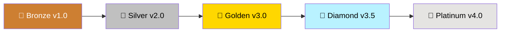

<p align="center">
  
</p>

<p align="center">
  
  
  
  
  
</p>

<p align="center">
  <a href="https://github.com/AminSharbati/AcadFlow/stargazers">
    
  </a>
  <a href="https://github.com/AminSharbati/AcadFlow/network/members">
    
  </a>
  <a href="https://github.com/AminSharbati/AcadFlow/watchers">
    
  </a>
</p>

<br>

---

<div align="center">

# 🎓 AcadFlow

## سیستم جامع مدیریت آموزشی | Educational Management System

<br>


<br><br>

```
╔══════════════════════════════════════════════════════════════╗
║                                                              ║
║   🏛️  یک پروژه — سه نسخه — بی‌نهایت امکان                     ║
║                                                              ║
║   🏆  One Project — Three Editions — Infinite Possibilities  ║
║                                                              ║
╚══════════════════════════════════════════════════════════════╝
```

<br>

---

## 🏛️ خانواده AcadFlow | The AcadFlow Family

<br>

<table>
<tr>
  <td align="center" width="33%" bgcolor="#1a1a2e">
    <br>
    <h1>🥉</h1>
    <h2>BRONZE</h2>
    <sub>نسخه برنزی v1.0</sub>
    <br><br>
    <table>
      <tr><td align="center">📦</td><td>تک فایل</td></tr>
      <tr><td align="center">🎯</td><td>CRUD پایه</td></tr>
      <tr><td align="center">🆔</td><td>کد ملی</td></tr>
      <tr><td align="center">🔍</td><td>فیلتر هوشمند</td></tr>
    </table>
    <br>
    <a href="bronze-v1/">
      
    </a>
    <br><br>
  </td>
  <td align="center" width="33%" bgcolor="#1a1a2e">
    <br>
    <h1>🥈</h1>
    <h2>SILVER</h2>
    <sub>نسخه نقره‌ای v2.0</sub>
    <br><br>
    <table>
      <tr><td align="center">📦</td><td>تک فایل</td></tr>
      <tr><td align="center">🔍</td><td>+ جستجوی لحظه‌ای</td></tr>
      <tr><td align="center">📊</td><td>+ گزارش معدل</td></tr>
      <tr><td align="center">📦</td><td>+ ظرفیت کلاس</td></tr>
    </table>
    <br>
    <a href="silver-v2/">
      
    </a>
    <br><br>
  </td>
  <td align="center" width="33%" bgcolor="#1a1a2e">
    <br>
    <h1>🥇</h1>
    <h2>GOLDEN</h2>
    <sub>نسخه طلایی v3.0</sub>
    <br><br>
    <table>
      <tr><td align="center">📁</td><td>۱۷ فایل ماژولار</td></tr>
      <tr><td align="center">🔒</td><td>+ احراز هویت</td></tr>
      <tr><td align="center">📊</td><td>+ داشبورد تحلیلی</td></tr>
      <tr><td align="center">📄</td><td>+ PDF فارسی + Excel</td></tr>
    </table>
    <br>
    <a href="golden-v3/">
      
    </a>
    <br><br>
  </td>
</tr>
</table>

<br>

---

## 🎯 کدام نسخه برای شما مناسب است؟ | Which Edition is Right for You?

<br>

<table>
<tr>
  <td align="center" width="33%">
    <h3>🥉 برنزی</h3>
    <sub>Bronze Edition</sub>
    <br><br>
    <b>مناسب برای:</b>
    <br>
    ✓ شروع کار
    <br>
    ✓ تیم‌های کوچک
    <br>
    ✓ نیاز به سادگی
    <br><br>
    <b>ندارد:</b>
    <br>
    ✗ گزارش معدل
    <br>
    ✗ جستجو
    <br>
    ✗ احراز هویت
  </td>
  <td align="center" width="33%">
    <h3>🥈 نقره‌ای</h3>
    <sub>Silver Edition</sub>
    <br><br>
    <b>مناسب برای:</b>
    <br>
    ✓ سازمان‌ها
    <br>
    ✓ مؤسسات آموزشی
    <br>
    ✓ نیاز به گزارش
    <br><br>
    <b>ندارد:</b>
    <br>
    ✗ احراز هویت
    <br>
    ✗ داشبورد
    <br>
    ✗ خروجی PDF
  </td>
  <td align="center" width="33%">
    <h3>🥇 طلایی</h3>
    <sub>Golden Edition</sub>
    <br><br>
    <b>مناسب برای:</b>
    <br>
    ✓ دانشگاه‌ها
    <br>
    ✓ سیستم‌های چندکاربره
    <br>
    ✓ نیاز حرفه‌ای
    <br><br>
    <b>همه چیز دارد!</b>
    <br>
    ✓ کامل‌ترین نسخه
  </td>
</tr>
</table>

</div>

<br>

---

## 🆚 مقایسه کامل نسخه‌ها | Full Feature Comparison

<div align="center">

| ویژگی | 🥉 Bronze v1.0 | 🥈 Silver v2.0 | 🥇 Golden v3.0 |
|:------|:---------:|:---------:|:---------:|
| **CRUD کامل** | ✅ | ✅ | ✅ |
| **Code First** | ✅ | ✅ | ✅ |
| **Enum** | ✅ | ✅ | ✅ |
| **فیلتر هوشمند** | ✅ | ✅ | ✅ |
| **کد ملی** | ✅ | ✅ | ✅ |
| **کد دانشجویی** | ✅ | ✅ | ✅ |
| **تم تیره** | ✅ | ✅ | ✅ |
| **نوار وضعیت** | ✅ | ✅ | ✅ |
| **منوی راست‌کلیک** | ✅ | ✅ | ✅ |
| **اسکرول‌بار** | ✅ | ✅ | ✅ |
| **FK فعال** | ✅ | ✅ | ✅ |
| **گزارش معدل** | ❌ | ✅ | ✅ |
| **جستجوی لحظه‌ای** | ❌ | ✅ | ✅ |
| **ظرفیت کلاس** | ❌ | ✅ | ✅ |
| **وضعیت قبول/مردود** | ❌ | ✅ | ✅ |
| **لیست جستجوی دانشجو** | ❌ | ✅ | ✅ |
| **احراز هویت** | ❌ | ❌ | ✅ |
| **۴ سطح دسترسی** | ❌ | ❌ | ✅ |
| **bcrypt** | ❌ | ❌ | ✅ |
| **بازیابی رمز** | ❌ | ❌ | ✅ |
| **قفل خودکار** | ❌ | ❌ | ✅ |
| **داشبورد مدیریتی** | ❌ | ❌ | ✅ |
| **نمودارهای آماری** | ❌ | ❌ | ✅ |
| **PDF فارسی راست‌چین** | ❌ | ❌ | ✅ |
| **خروجی Excel** | ❌ | ❌ | ✅ |
| **مدیریت کاربران** | ❌ | ❌ | ✅ |
| **ایجاد خودکار کاربر** | ❌ | ❌ | ✅ |
| **تاریخچه فعالیت‌ها** | ❌ | ❌ | ✅ |
| **چند فایلی (ماژولار)** | ❌ | ❌ | ✅ |
| **ساختار** | تک فایل | تک فایل | ۱۷ فایل |
| **خطوط کد** | ~۶۰۰ | ~۱۰۰۰ | ~۳۵۰۰ |
| **کتابخانه‌های اضافی** | ۱ | ۱ | ۸ |

</div>

<br>

---

## 🗺️ نقشه راه | Roadmap

<div align="center">



<br>

| نسخه | وضعیت | ویژگی‌های شاخص |
|:-----|:------|:---------------|
| 🥉 **Bronze v1.0** | ✅ منتشر شده | CRUD پایه + فیلتر هوشمند |
| 🥈 **Silver v2.0** | ✅ منتشر شده | + جستجو + گزارش + ظرفیت |
| 🥇 **Golden v3.0** | ✅ منتشر شده | + احراز هویت + داشبورد + PDF |
| 💎 **Diamond v3.5** | 🔄 در حال توسعه | + تقویم ترمی + اعلان‌ها + تم‌های جدید |
| 👑 **Platinum v4.0** | 💭 برنامه‌ریزی | + Web API + موبایل + هوش مصنوعی |

</div>

---

## 🏗️ معماری سیستم | System Architecture

<div align="center">

```
┌─────────────────────────────────────────────────────┐
│              🖥️  Presentation Layer                   │
│         Tkinter GUI — Windows — Tabs                 │
├─────────────────────────────────────────────────────┤
│              ⚙️  Business Layer                       │
│     AuthManager  │  BaseTab  │  ReportGenerator      │
├─────────────────────────────────────────────────────┤
│              🗄️  Data Layer                           │
│   SQLAlchemy ORM  │  SQLite  │  7 Models             │
└─────────────────────────────────────────────────────┘
```

### 📊 نمودار ER | Entity-Relationship Diagram

```
┌──────────┐     ┌──────────────┐     ┌──────────┐
│  Master   │────<│ Presentation │>────│  Lesson   │
│ (اساتید)  │ 1:N │  (ارائه دروس) │ N:1 │  (دروس)   │
└──────────┘     └──────┬───────┘     └──────────┘
                        │ 1:N
                   ┌────┴───────┐
                   │  Selection  │
                   │ (انتخاب واحد)│
                   └────┬───────┘
                        │ N:1
              ┌─────────┴─────────┐
              ▼                   ▼
        ┌──────────┐        ┌──────────┐
        │  Student  │        │   User    │
        │ (دانشجویان)│        │ (کاربران) │
        └──────────┘        └──────────┘
```

</div>

---

## 🛠️ فناوری‌ها | Technology Stack

<div align="center">

<table>
<tr>
  <td align="center"></td>
  <td align="center"></td>
  <td align="center"></td>
  <td align="center"></td>
</tr>
<tr>
  <td align="center"></td>
  <td align="center"></td>
  <td align="center"></td>
  <td align="center"></td>
</tr>
</table>

</div>

---

## 📁 ساختار ریپازیتوری | Repository Structure

<div align="center">

```
📦 AcadFlow/
│
├── 📁 bronze-v1/                    # 🥉 نسخه برنزی
│   ├── 🚀 AcadFlow_Bronze.py        # تک فایل ~۶۰۰ خط
│   ├── 📸 screenshots/              # اسکرین‌شات‌ها
│   ├── 📦 requirements.txt          # sqlalchemy
│   └── 📖 README.md
│
├── 📁 silver-v2/                    # 🥈 نسخه نقره‌ای
│   ├── 🚀 AcadFlow_Silver.py        # تک فایل ~۱۰۰۰ خط
│   ├── 📸 screenshots/              # اسکرین‌شات‌ها
│   ├── 📦 requirements.txt          # sqlalchemy
│   └── 📖 README.md
│
├── 📁 golden-v3/                    # 🥇 نسخه طلایی
│   ├── 🚀 main.py                   # نقطه ورود
│   ├── ⚙️ config.py                 # تنظیمات
│   ├── 🗄️ database.py               # اتصال دیتابیس
│   ├── 📊 models.py                 # ۷ مدل
│   ├── 🔐 auth.py                   # احراز هویت
│   ├── 🔑 login_window.py           # صفحه ورود
│   ├── 🖥️ main_window.py            # پنجره اصلی
│   ├── 📁 tabs/                     # ۸ فایل تب
│   ├── 📸 screenshots/              # اسکرین‌شات‌ها
│   ├── 📦 requirements.txt          # ۸ کتابخانه
│   └── 📖 README.md
│
├── 🎨 acadflow.ico                 # آیکون مشترک
├── 📖 README.md                    # همین فایل
└── 📄 LICENSE                      # مجوز MIT
```

</div>

---

## 🚀 شروع سریع | Quick Start

<div align="center">

### 🥉 برنزی

```bash
pip install sqlalchemy
python bronze-v1/main.py
```

### 🥈 نقره‌ای

```bash
pip install sqlalchemy
python silver-v2/main.py
```

### 🥇 طلایی

```bash
cd golden-v3
pip install -r requirements.txt
python main.py
```

</div>

---

## 📊 آمار کلی پروژه | Overall Statistics

<div align="center">

| 📏 معیار | 🥉 Bronze | 🥈 Silver | 🥇 Golden | 📦 **کل** |
|:--------:|:---:|:---:|:---:|:---:|
| 📁 **فایل‌ها** | ۱ | ۱ | ۱۷ | **۱۹** |
| 🏛️ **کلاس‌ها** | ۶ | ۷ | ۱۶ | **۲۹** |
| 🗄️ **جداول** | ۵ | ۵ | ۷ | **۱۷** |
| 📝 **خطوط کد** | ۶۰۰ | ۱۰۰۰ | ۳۵۰۰ | **۵۱۰۰** |
| 📦 **کتابخانه** | ۱ | ۱ | ۸ | **۱۰** |

</div>

---

## 👨‍💻 توسعه‌دهنده | Developer

<div align="center">

<br>

<table>
  <tr>
    <td align="center">
      
      <br><br>
      <b>AminSharbati</b>
      <br>
      <sub>Python & Software Developer-Engineer</sub>
      <br><br>
      <a href="https://github.com/AminSharbati">
        
      </a>
    </td>
  </tr>
</table>

<br>

### 🏆 ارائه شده توسط | Powered by


</div>

---

## 📄 مجوز | License

<div align="center">

```
MIT License — Copyright (c) 2026 داتین آریا | Datin Arya
```


</div>

---

<br>

<div align="center">

## ⭐ به پروژه ستاره بده! | Star the Project! ⭐


<br><br>

---


<br><br>

# 🎓 آموزش هوشمند، مدیریت آسان

## Smart Education, Easy Management

<br>


<br><br>

---

<p align="center">
  <sub>✨ Generated with ❤️ by Amin Sharbati | ۱۴۰۵ | 2026 ✨</sub>
</p>

</div>
---

اینم از README اصلی ریپازیتوری. همه نسخه‌ها رو معرفی می‌کنه، مقایسه کامل داره، نقشه راه داره، نمودار ER داره، و کلی بج و ایموجی و رنگ. 🚀
