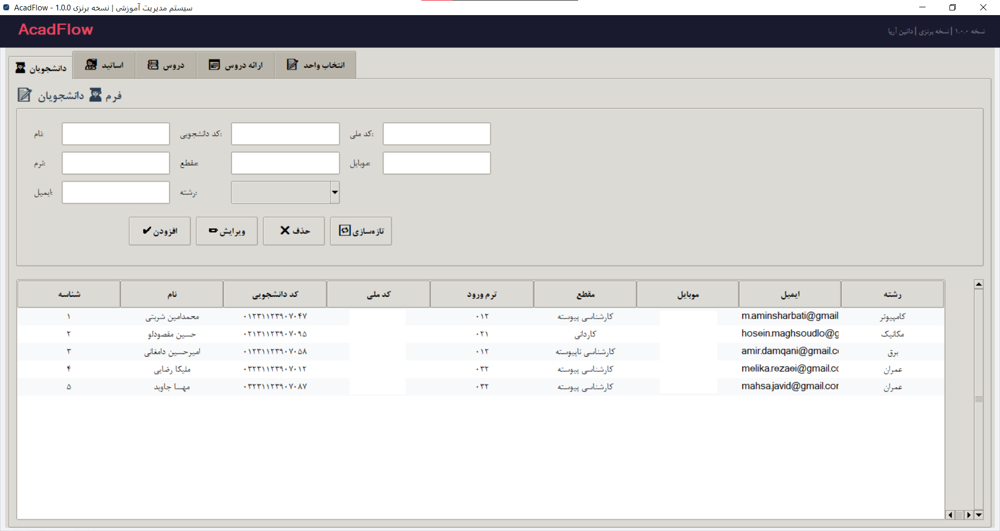
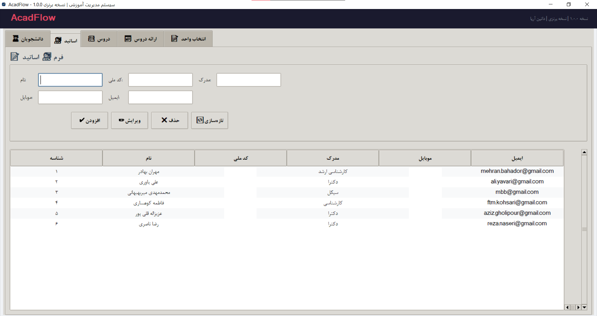
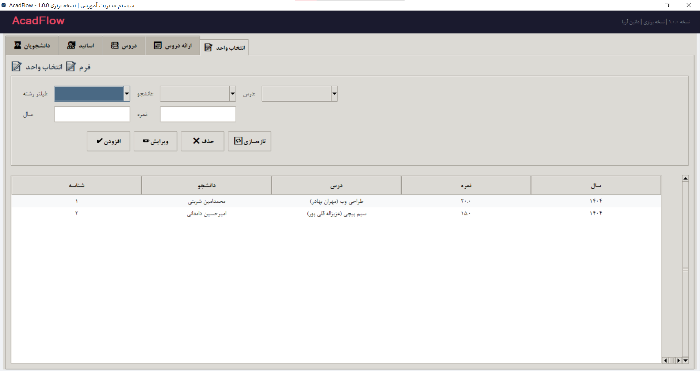
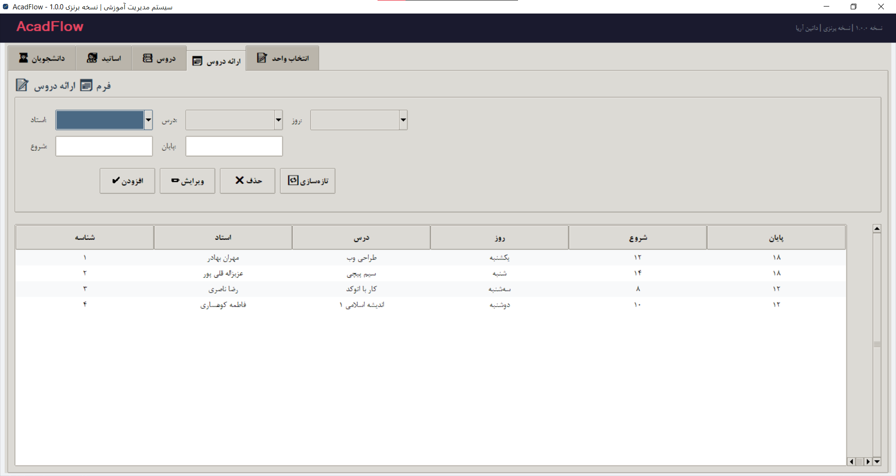

<p align="center">
  
</p>

<p align="center">
  
  
  
  
  
</p>

<p align="center">
  
  
  
  
</p>

<br>

---

<div align="center">

# 🥉 AcadFlow v1.0

## Bronze Edition | نسخه برنزی

<br>


<br><br>

```
╔══════════════════════════════════════════════════════╗
║                                                      ║
║   🏛️  سیستم مدیریت آموزشی  |  Educational System     ║
║                                                      ║
║   🎓  نسخه پایه و سازمانی  |  Basic Organizational   ║
║                                                      ║
╚══════════════════════════════════════════════════════╝
```

<br>

### 🆚 جایگاه در خانواده AcadFlow

<table>
<tr>
<td align="center" width="33%" bgcolor="#CD7F32">
  <h2>🥉 BRONZE</h2>
  <sub>v1.0 — شما اینجا هستید</sub>
  <br><br>
  <b>CRUD پایه + کدملی</b>
</td>
<td align="center" width="33%" bgcolor="#1a1a2e">
  <h2>🥈 SILVER</h2>
  <sub>v2.0</sub>
  <br><br>
  + جستجو + ظرفیت + گزارش
</td>
<td align="center" width="33%" bgcolor="#1a1a2e">
  <h2>🥇 GOLDEN</h2>
  <sub>v3.0</sub>
  <br><br>
  + احراز هویت + داشبورد + PDF
</td>
</tr>
</table>

</div>

<br>

---

## 📖 درباره پروژه | About

<div align="center">

> **AcadFlow Bronze Edition** — نقطه شروع. نسخه‌ای که همه چیز از آن آغاز شد.

> بدون پیچیدگی، بدون اضافات، بدون اتلاف وقت. **فقط آنچه نیاز دارید.**

<br>

### 🎯 چرا نسخه برنزی؟

<table>
<tr>
  <td align="center">🏗️</td>
  <td><b>Code First</b></td>
  <td>تمام ساختار دیتابیس در کد — بدون ابزار خارجی</td>
</tr>
<tr>
  <td align="center">🎯</td>
  <td><b>سادگی محض</b></td>
  <td>فقط CRUD — بدون هیچ پیچیدگی اضافه</td>
</tr>
<tr>
  <td align="center">📦</td>
  <td><b>تک فایلی</b></td>
  <td>یک فایل = کل برنامه — نصب و اجرا در ۳۰ ثانیه</td>
</tr>
<tr>
  <td align="center">🎨</td>
  <td><b>تم تیره مدرن</b></td>
  <td>رابط کاربری چشم‌نواز با فونت فارسی</td>
</tr>
<tr>
  <td align="center">🔍</td>
  <td><b>فیلتر هوشمند</b></td>
  <td>انتخاب رشته → فیلتر خودکار دانشجو و درس</td>
</tr>
</table>

</div>

## 🖼️ گالری تصاویر | Screenshots Gallery

<p align="center">
  
  
</p>

<p align="center">
  
  
</p>

<br>

---

## ✨ ویژگی‌ها | Features

<br>

<table align="center">
<tr>
  <td align="center" width="50%">
    <h3>👨‍🎓 مدیریت دانشجویان</h3>
    <sub>Student Management</sub>
    <br><br>
    <table>
      <tr><td>📋</td><td>۹ فیلد اطلاعاتی</td></tr>
      <tr><td>🆔</td><td>کد ملی + کد دانشجویی</td></tr>
      <tr><td>➕</td><td>افزودن / ویرایش / حذف</td></tr>
      <tr><td>🔍</td><td>فیلتر زنجیره‌ای</td></tr>
    </table>
  </td>
  <td align="center" width="50%">
    <h3>👨‍🏫 مدیریت اساتید</h3>
    <sub>Master Management</sub>
    <br><br>
    <table>
      <tr><td>📋</td><td>۵ فیلد اطلاعاتی</td></tr>
      <tr><td>🆔</td><td>کد ملی</td></tr>
      <tr><td>➕</td><td>افزودن / ویرایش / حذف</td></tr>
      <tr><td>📊</td><td>منوی راست‌کلیک</td></tr>
    </table>
  </td>
</tr>
<tr>
  <td align="center" width="50%">
    <h3>📚 مدیریت دروس</h3>
    <sub>Lesson Management</sub>
    <br><br>
    <table>
      <tr><td>📖</td><td>نام + واحد + رشته</td></tr>
      <tr><td>➕</td><td>افزودن / ویرایش / حذف</td></tr>
      <tr><td>🎨</td><td>رنگ‌بندی ردیف‌ها</td></tr>
    </table>
  </td>
  <td align="center" width="50%">
    <h3>📅 ارائه دروس</h3>
    <sub>Course Scheduling</sub>
    <br><br>
    <table>
      <tr><td>🕐</td><td>روز + ساعت + استاد + درس</td></tr>
      <tr><td>🔗</td><td>منوهای کشویی FK</td></tr>
      <tr><td>📊</td><td>اسکرول‌بار افقی و عمودی</td></tr>
    </table>
  </td>
</tr>
<tr>
  <td align="center" colspan="2">
    <h3>📝 انتخاب واحد</h3>
    <sub>Course Enrollment</sub>
    <br><br>
    <table>
      <tr><td>🔍</td><td><b>فیلتر هوشمند:</b> انتخاب رشته → فیلتر دانشجو و درس</td></tr>
      <tr><td>📝</td><td>ثبت نمره (۰ تا ۲۰)</td></tr>
      <tr><td>🎯</td><td>اعتبارسنجی خودکار</td></tr>
    </table>
  </td>
</tr>
</table>

<br>

### 🎨 ویژگی‌های ظاهری

| 🎨 | ویژگی |
|:---:|--------|
| 🌙 | **تم تیره** (Dark Mode) |
| 🔤 | **فونت فارسی** B Nazanin |
| 🎯 | **نوار وضعیت** با نمایش پیام |
| 🏢 | **هدر** با نام نسخه و شرکت |
| 📋 | **منوی راست‌کلیک** روی جداول |
| 🎨 | **رنگ‌بندی ردیف‌ها** (زوج/فرد) |
| 📊 | **اسکرول‌بار** عمودی و افقی |

---

## 🚀 نصب و اجرا | Quick Start

<div align="center">

### ⚡ ۳۰ ثانیه‌ای راه‌اندازی کن!

</div>

```bash
# ۱. نصب
pip install sqlalchemy

# ۲. اجرا 🚀
python main.py
```

<br>

<div align="center">

### 📋 پیش‌نیازها | Requirements

| نیازمندی | نسخه |
|:--------:|:-----:|
| 🐍 Python | 3.10+ |
| 🗄️ SQLAlchemy | 1.4+ |
| 🪟 Windows | 10/11 |

</div>

<br>

### 📦 ساخت فایل EXE

```bash
# نصب PyInstaller
pip install pyinstaller

# ساخت EXE با آیکون
pyinstaller --onefile --windowed --name "AcadFlow-Bronze" --icon=acadflow.ico main.py
```

<div align="center">

| خروجی | مسیر |
|:------|:-----|
| 📦 **EXE** | `dist/AcadFlow-Bronze.exe` |
| 📏 **حجم** | ~۱۵ MB |

</div>

---

## 📁 ساختار پروژه | Project Structure

<div align="center">

```
📦 AcadFlow-Bronze/
│
├── 🚀 AcadFlow_Bronze.py    ← کل برنامه در یک فایل!
├── 📦 requirements.txt       ← فقط sqlalchemy
├── 🎨 acadflow.ico          ← آیکون برنامه
└── 📖 README.md             ← همین فایل
```

> 💡 **تک فایلی یعنی:** بدون پوشه، بدون ماژول، بدون دردسر. یک فایل = کل برنامه.

</div>

---

## 🛠️ فناوری‌ها | Tech Stack

<div align="center">

<table>
<tr>
  <td align="center"></td>
  <td align="center"></td>
  <td align="center"></td>
  <td align="center"></td>
</tr>
</table>

| 🔧 فناوری | 📝 کاربرد |
|:----------:|:----------|
| **Python 3.14** | زبان اصلی |
| **Tkinter + ttk** | رابط کاربری گرافیکی |
| **SQLAlchemy 2.0** | Object-Relational Mapping |
| **SQLite 3** | پایگاه داده Embedded |
| **Enum** | مدیریت ثابت‌ها و لیست‌ها |

</div>

---

## 📊 آمار پروژه | Project Statistics

<div align="center">

| 📏 معیار | 🔢 مقدار |
|:--------:|:--------:|
| 🐍 **فایل‌های پایتون** | ۱ (تک فایل) |
| 🏛️ **کلاس‌ها** | ۶ |
| 🗄️ **جداول دیتابیس** | ۵ |
| 📋 **فیلدهای دیتابیس** | ۳۲ |
| 📝 **خطوط کد** | ۶۰۰+ |
| 🎯 **متدولوژی** | Code First |
| 📦 **حجم کد** | ~۲۵ KB |

</div>

---

## 🆚 جایگاه در خانواده AcadFlow | Family Position

<div align="center">

| ویژگی | 🥉 Bronze | 🥈 Silver | 🥇 Golden |
|:------|:---------:|:---------:|:---------:|
| **CRUD کامل** | ✅ | ✅ | ✅ |
| **Code First** | ✅ | ✅ | ✅ |
| **Enum** | ✅ | ✅ | ✅ |
| **فیلتر هوشمند** | ✅ | ✅ | ✅ |
| **کد ملی** | ✅ | ✅ | ✅ |
| **کد دانشجویی** | ✅ | ✅ | ✅ |
| **تم تیره** | ✅ | ✅ | ✅ |
| **نوار وضعیت** | ✅ | ✅ | ✅ |
| **منوی راست‌کلیک** | ✅ | ✅ | ✅ |
| **گزارش معدل** | ❌ | ✅ | ✅ |
| **جستجوی لحظه‌ای** | ❌ | ✅ | ✅ |
| **ظرفیت کلاس** | ❌ | ✅ | ✅ |
| **وضعیت قبول/مردود** | ❌ | ✅ | ✅ |
| **احراز هویت** | ❌ | ❌ | ✅ |
| **داشبورد** | ❌ | ❌ | ✅ |
| **PDF/Excel** | ❌ | ❌ | ✅ |
| **مدیریت کاربران** | ❌ | ❌ | ✅ |

</div>

---

<br>

<div align="center">

## 👨‍💻 توسعه‌دهنده | Developer

<br>

<table>
  <tr>
    <td align="center">
      
      <br><br>
      <b>AminSharbati</b>
      <br>
      <sub>Python & SoftWare Developer-Engeneere</sub>
      <br><br>
      <a href="https://github.com/AminSharbati">
        
      </a>
    </td>
  </tr>
</table>

<br>

### 🏆 ارائه شده توسط | Powered by


</div>

---

## 📄 مجوز | License

<div align="center">

```
MIT License — Copyright (c) 2026 داتین آریا | Datin Arya
```


</div>

---

<br>

<div align="center">

## ⭐ به پروژه ستاره بده! | Star the Project! ⭐


<br><br>

---


<br><br>

# 🎓 آموزش هوشمند، مدیریت آسان

## Smart Education, Easy Management

<br>


</div>

---

<p align="center">
  <sub>✨ Generated with ❤️ by Amin Sharbati | ۱۴۰۵ | 2026 ✨</sub>
</p>