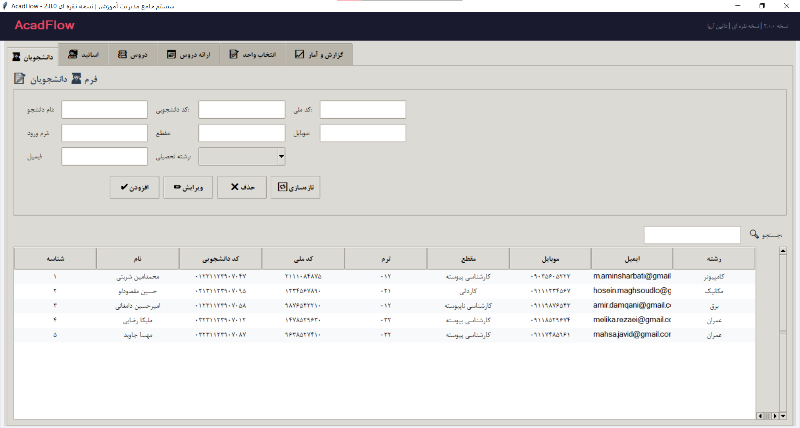
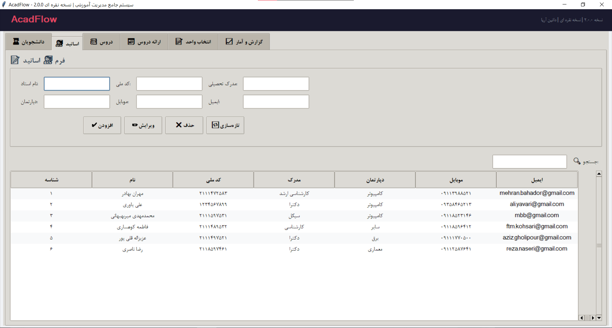
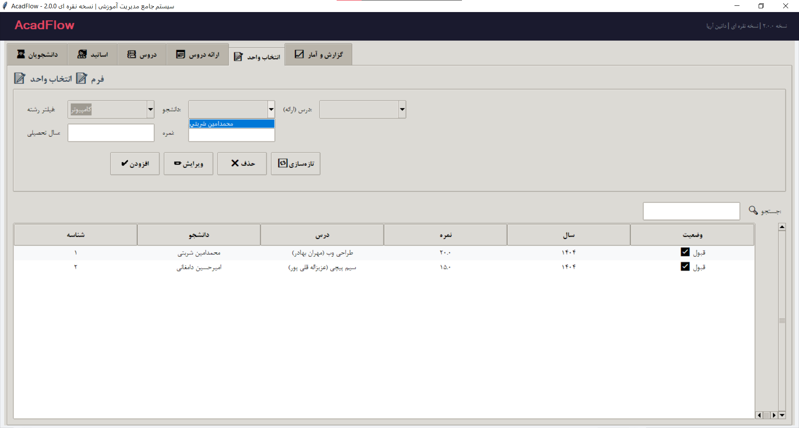
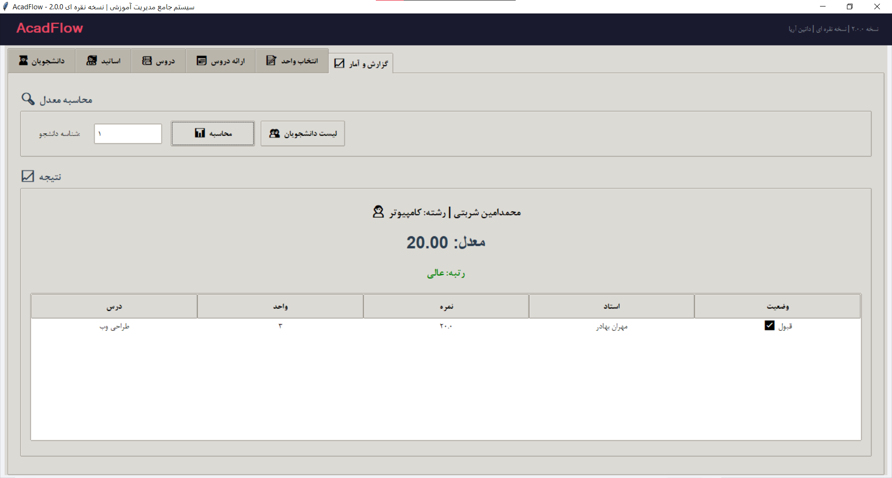

<p align="center">
  
</p>

<p align="center">
  
  
  
  
  
</p>

<p align="center">
  
  
  
  
</p>

<br>

---

<div align="center">

# 🥈 AcadFlow v2.0

## Silver Edition | نسخه نقره‌ای

<br>


<br><br>

```
╔══════════════════════════════════════════════════════╗
║                                                      ║
║   🏛️  سیستم جامع مدیریت آموزشی  |  Full Management   ║
║                                                      ║
║   🎓  نسخه سازمانی پیشرفته  |  Advanced Corporate    ║
║                                                      ║
╚══════════════════════════════════════════════════════╝
```

<br>

### 🆚 جایگاه در خانواده AcadFlow

<table>
<tr>
<td align="center" width="33%" bgcolor="#1a1a2e">
  <h2>🥉 BRONZE</h2>
  <sub>v1.0</sub>
  <br><br>
  CRUD پایه + کدملی
</td>
<td align="center" width="33%" bgcolor="#808080">
  <h2>🥈 SILVER</h2>
  <sub>v2.0 — شما اینجا هستید</sub>
  <br><br>
  <b>+ جستجو + ظرفیت + گزارش</b>
</td>
<td align="center" width="33%" bgcolor="#1a1a2e">
  <h2>🥇 GOLDEN</h2>
  <sub>v3.0</sub>
  <br><br>
  + احراز هویت + داشبورد + PDF
</td>
</tr>
</table>

</div>

<br>

---

## 🖼️ گالری تصاویر | Screenshots Gallery

<p align="center">
  
  
</p>

<p align="center">
  
  
</p>

---

## 📖 درباره پروژه | About

<div align="center">

> **AcadFlow Silver Edition** — پلی بین سادگی و قدرت.

> نسخه‌ای که امکانات حرفه‌ای را بدون پیچیدگی احراز هویت ارائه می‌دهد. مناسب سازمان‌ها و مؤسسات.

</div>

<br>

### 🆕 چه چیزهایی نسبت به نسخه برنزی اضافه شده؟

<table>
<tr>
  <td align="center">🔍</td>
  <td><b>جستجوی لحظه‌ای</b></td>
  <td>نوار جستجو در تمام جداول — فیلتر زنده با تایپ</td>
</tr>
<tr>
  <td align="center">📊</td>
  <td><b>گزارش معدل</b></td>
  <td>محاسبه معدل وزنی + رتبه‌بندی عالی/متوسط/ضعیف</td>
</tr>
<tr>
  <td align="center">📋</td>
  <td><b>وضعیت قبول/مردود</b></td>
  <td>نمایش خودکار وضعیت هر درس در انتخاب واحد</td>
</tr>
<tr>
  <td align="center">📦</td>
  <td><b>ظرفیت کلاس</b></td>
  <td>مدیریت ظرفیت و شمارنده ثبت‌نام</td>
</tr>
<tr>
  <td align="center">👥</td>
  <td><b>لیست جستجوی دانشجو</b></td>
  <td>پنجره جستجوی دانشجو با فیلتر زنده در گزارش</td>
</tr>
<tr>
  <td align="center">🏢</td>
  <td><b>دپارتمان اساتید</b></td>
  <td>فیلد جدید برای گروه آموزشی</td>
</tr>
</table>

---

## ✨ ویژگی‌ها | Features

<br>

<table align="center">
<tr>
  <td align="center" width="50%">
    <h3>👨‍🎓 مدیریت دانشجویان</h3>
    <sub>Student Management</sub>
    <br><br>
    <table>
      <tr><td>📋</td><td>۹ فیلد کامل</td></tr>
      <tr><td>🆔</td><td>کد ملی + کد دانشجویی</td></tr>
      <tr><td>🔍</td><td><b>جستجوی لحظه‌ای</b> در جدول</td></tr>
      <tr><td>🎨</td><td>رنگ‌بندی + منوی راست‌کلیک</td></tr>
    </table>
  </td>
  <td align="center" width="50%">
    <h3>👨‍🏫 مدیریت اساتید</h3>
    <sub>Master Management</sub>
    <br><br>
    <table>
      <tr><td>📋</td><td>۷ فیلد کامل</td></tr>
      <tr><td>🆔</td><td>کد ملی</td></tr>
      <tr><td>🏢</td><td><b>دپارتمان</b> (جدید)</td></tr>
      <tr><td>🔍</td><td>جستجوی لحظه‌ای</td></tr>
    </table>
  </td>
</tr>
<tr>
  <td align="center" width="50%">
    <h3>📚 مدیریت دروس</h3>
    <sub>Lesson Management</sub>
    <br><br>
    <table>
      <tr><td>📖</td><td>نام + واحد + رشته</td></tr>
      <tr><td>📦</td><td><b>ظرفیت‌بندی</b> (جدید)</td></tr>
      <tr><td>📝</td><td>توضیحات درس</td></tr>
    </table>
  </td>
  <td align="center" width="50%">
    <h3>📅 ارائه دروس</h3>
    <sub>Course Scheduling</sub>
    <br><br>
    <table>
      <tr><td>🕐</td><td>روز + ساعت + استاد + درس</td></tr>
      <tr><td>📦</td><td><b>ظرفیت کلاس + شمارنده ثبت‌نام</b></td></tr>
      <tr><td>🔗</td><td>منوهای کشویی FK</td></tr>
    </table>
  </td>
</tr>
<tr>
  <td align="center" width="50%">
    <h3>📝 انتخاب واحد</h3>
    <sub>Course Enrollment</sub>
    <br><br>
    <table>
      <tr><td>🔍</td><td>فیلتر هوشمند (رشته → دانشجو → درس)</td></tr>
      <tr><td>📝</td><td>ثبت نمره (۰ تا ۲۰)</td></tr>
      <tr><td>📋</td><td><b>وضعیت قبول/مردود</b> (جدید)</td></tr>
    </table>
  </td>
  <td align="center" width="50%">
    <h3>📈 گزارش و آمار</h3>
    <sub>Reports & Statistics</sub>
    <br><br>
    <table>
      <tr><td>🧮</td><td><b>محاسبه معدل وزنی</b> (جدید)</td></tr>
      <tr><td>🏅</td><td>رتبه‌بندی (عالی/متوسط/ضعیف)</td></tr>
      <tr><td>👥</td><td><b>لیست دانشجویان با جستجو</b></td></tr>
    </table>
  </td>
</tr>
</table>

<br>

### 🎨 ویژگی‌های ظاهری

|   🎨   | ویژگی                        |
| :---: | ---------------------------- |
|   🌙   | **تم تیره** (Dark Mode)      |
|   🔤   | **فونت فارسی** B Nazanin     |
|   🔍   | **نوار جستجو** در همه تب‌ها   |
|   🎯   | **نوار وضعیت** با نام شرکت   |
|   🏢   | **هدر** با نام نسخه و شرکت   |
|   📋   | **منوی راست‌کلیک** روی جداول  |
|   🎨   | **رنگ‌بندی ردیف‌ها** (زوج/فرد) |
|   📊   | **اسکرول‌بار** عمودی و افقی   |

---

## 🚀 نصب و اجرا | Quick Start

<div align="center">

### ⚡ ۳۰ ثانیه‌ای راه‌اندازی کن!

</div>

```bash
# ۱. نصب
pip install sqlalchemy

# ۲. اجرا 🚀
python main.py
```

<br>

<div align="center">

### 📋 پیش‌نیازها | Requirements

|   نیازمندی   | نسخه  |
| :----------: | :---: |
|   🐍 Python   | 3.10+ |
| 🗄️ SQLAlchemy | 1.4+  |
|  🪟 Windows   | 10/11 |

</div>

<br>

### 📦 ساخت فایل EXE

```bash
# نصب PyInstaller
pip install pyinstaller

# ساخت EXE با آیکون
pyinstaller --onefile --windowed --name "AcadFlow-Silver" --icon=acadflow.ico main.py
```

<div align="center">

| خروجی     | مسیر                       |
| :-------- | :------------------------- |
| 📦 **EXE** | `dist/AcadFlow-Silver.exe` |
| 📏 **حجم** | ~۲۰ MB                     |

</div>

---

## 📁 ساختار پروژه | Project Structure

<div align="center">

```
📦 AcadFlow-Silver/
│
├── 🚀 AcadFlow_Silver.py    ← کل برنامه در یک فایل (۱۰۰۰+ خط)
├── 📸 screenshots/           ← اسکرین‌شات‌ها
├── 📦 requirements.txt       ← فقط sqlalchemy
├── 🎨 acadflow.ico          ← آیکون برنامه
└── 📖 README.md             ← همین فایل
```

</div>

---

## 🛠️ فناوری‌ها | Tech Stack

<div align="center">

<table>
<tr>
  <td align="center"></td>
  <td align="center"></td>
  <td align="center"></td>
  <td align="center"></td>
</tr>
</table>

|      🔧 فناوری      | 📝 کاربرد            |
| :----------------: | :------------------ |
|  **Python 3.14**   | زبان اصلی           |
| **Tkinter + ttk**  | رابط کاربری گرافیکی |
| **SQLAlchemy 2.0** | ORM                 |
|    **SQLite 3**    | پایگاه داده         |
|      **Enum**      | مدیریت ثابت‌ها       |

</div>

---

## 📊 آمار پروژه | Project Statistics

<div align="center">

|        📏 معیار        |   🔢 مقدار   |
| :-------------------: | :---------: |
| 🐍 **فایل‌های پایتون**  | ۱ (تک فایل) |
|     🏛️ **کلاس‌ها**      |      ۷      |
|  🗄️ **جداول دیتابیس**  |      ۵      |
| 📋 **فیلدهای دیتابیس** |     ۳۸      |
|     📝 **خطوط کد**     |    ۱۰۰۰+    |
|    🎯 **متدولوژی**     | Code First  |
|     📦 **حجم کد**      |   ~۴۰ KB    |

</div>

---

## 🆚 مقایسه کامل نسخه‌ها | Full Comparison

<div align="center">

| ویژگی                | 🥉 Bronze | 🥈 Silver | 🥇 Golden |
| :------------------- | :------: | :------: | :------: |
| **CRUD کامل**        |    ✅     |    ✅     |    ✅     |
| **Code First**       |    ✅     |    ✅     |    ✅     |
| **Enum**             |    ✅     |    ✅     |    ✅     |
| **فیلتر هوشمند**     |    ✅     |    ✅     |    ✅     |
| **کد ملی**           |    ✅     |    ✅     |    ✅     |
| **کد دانشجویی**      |    ✅     |    ✅     |    ✅     |
| **تم تیره**          |    ✅     |    ✅     |    ✅     |
| **نوار وضعیت**       |    ✅     |    ✅     |    ✅     |
| **منوی راست‌کلیک**    |    ✅     |    ✅     |    ✅     |
| **گزارش معدل**       |    ❌     |    ✅     |    ✅     |
| **جستجوی لحظه‌ای**    |    ❌     |    ✅     |    ✅     |
| **ظرفیت کلاس**       |    ❌     |    ✅     |    ✅     |
| **وضعیت قبول/مردود** |    ❌     |    ✅     |    ✅     |
| **لیست جستجو**       |    ❌     |    ✅     |    ✅     |
| **احراز هویت**       |    ❌     |    ❌     |    ✅     |
| **داشبورد**          |    ❌     |    ❌     |    ✅     |
| **PDF/Excel**        |    ❌     |    ❌     |    ✅     |
| **مدیریت کاربران**   |    ❌     |    ❌     |    ✅     |
| **چند فایلی**        |    ❌     |    ❌     |    ✅     |
| **bcrypt**           |    ❌     |    ❌     |    ✅     |

</div>

---

<br>

<div align="center">

## 👨‍💻 توسعه‌دهنده | Developer

<br>

<table>
  <tr>
    <td align="center">
      
      <br><br>
      <b>AminSharbati</b>
      <br>
      <sub>Python & Software Developer-Engineer</sub>
      <br><br>
      <a href="https://github.com/AminSharbati">
        
      </a>
    </td>
  </tr>
</table>

<br>

### 🏆 ارائه شده توسط | Powered by


</div>

---

## 📄 مجوز | License

<div align="center">

```
MIT License — Copyright (c) 2026 داتین آریا | Datin Arya
```


</div>

---

<br>

<div align="center">

## ⭐ به پروژه ستاره بده! | Star the Project! ⭐


<br><br>

---


<br><br>

# 🎓 آموزش هوشمند، مدیریت آسان

## Smart Education, Easy Management

<br>


</div>

---

<p align="center">
  <sub>✨ Generated with ❤️ by Amin Sharbati | ۱۴۰۵ | 2026 ✨</sub>
</p>