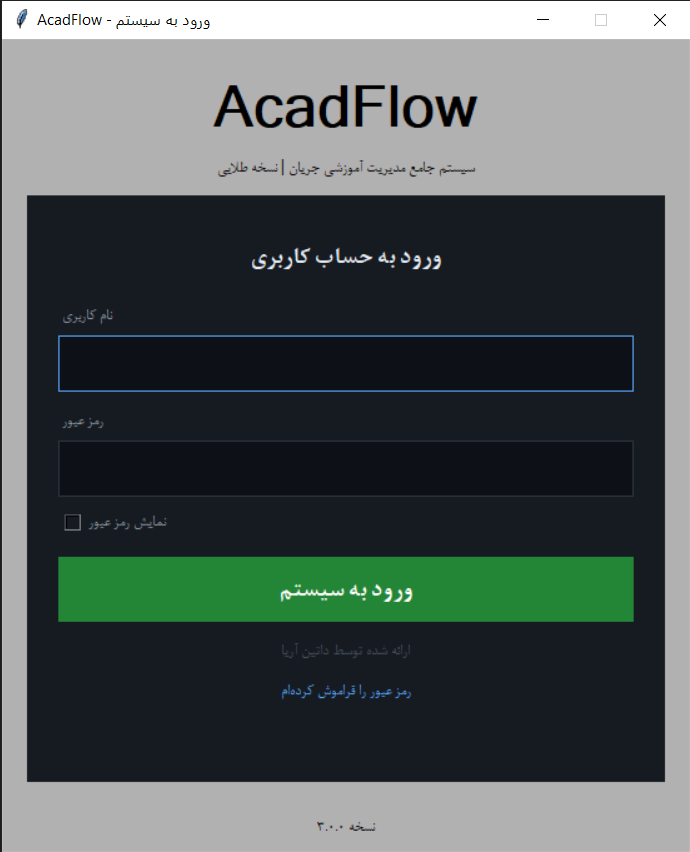
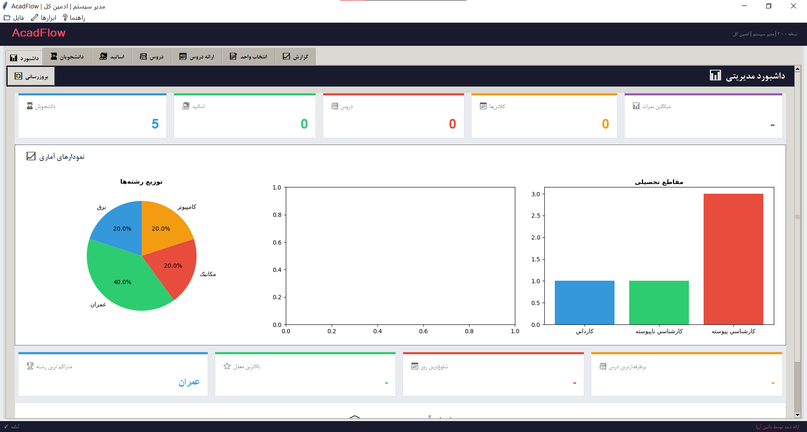
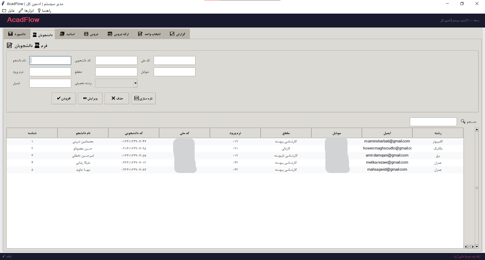
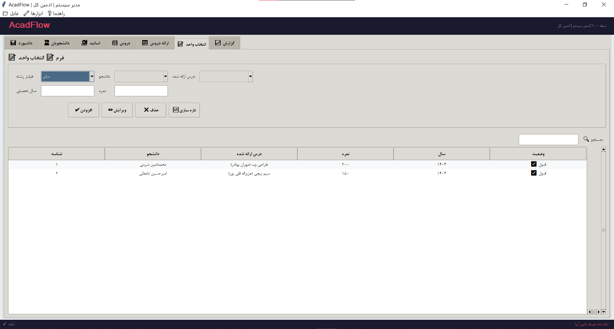
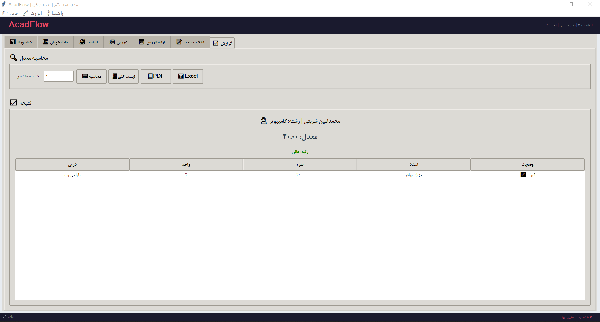
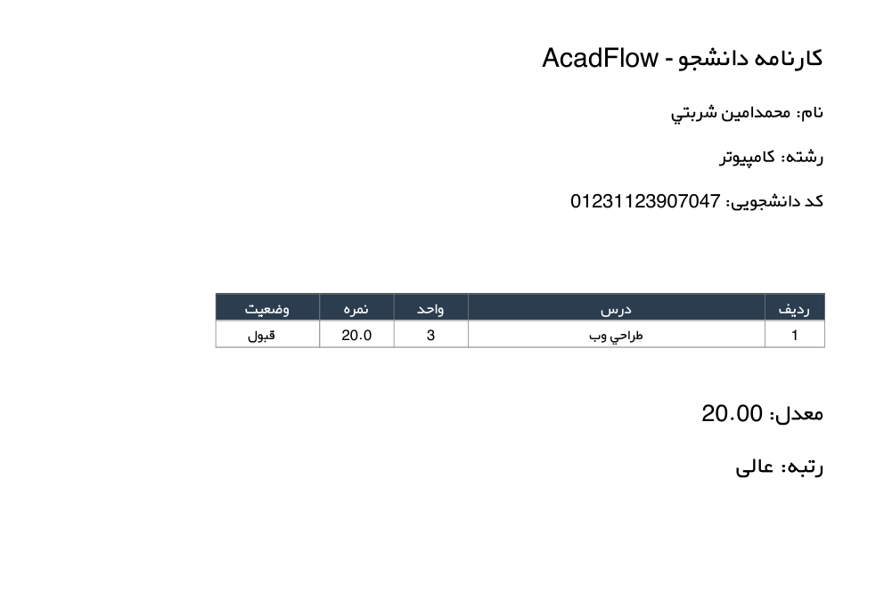
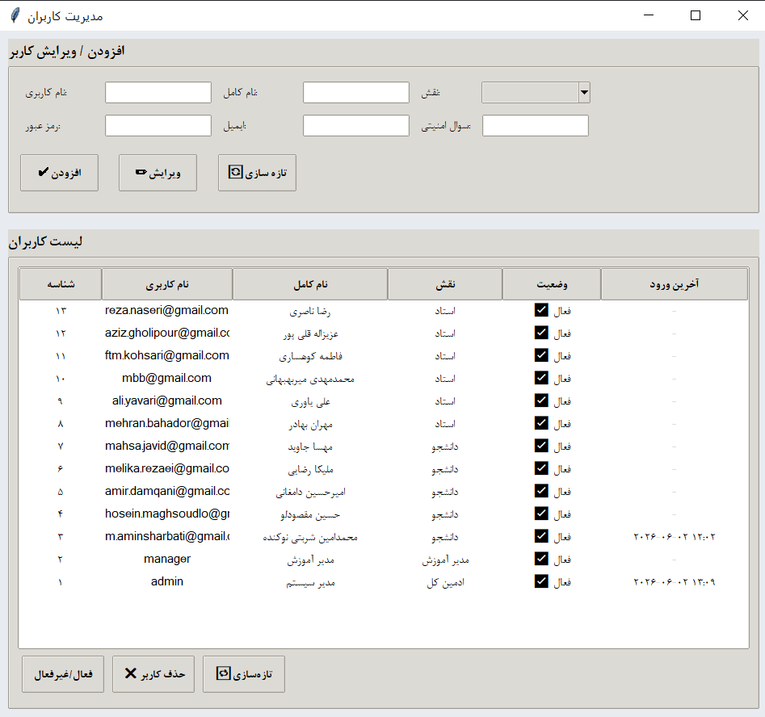
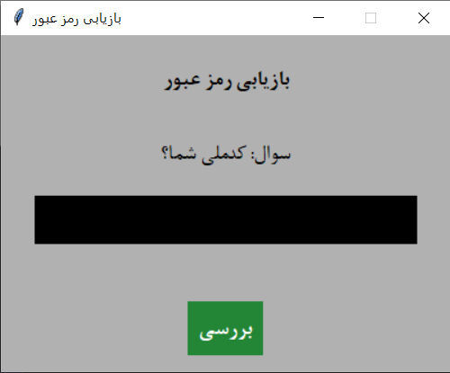

<p align="center">
  
</p>

<p align="center">
  
  
  
  
  
</p>

<p align="center">
  
  
  
  
</p>

<br>

<p align="center">
  
  
  
</p>

---

<br>

# 🥇 AcadFlow v3.0 — Golden Edition

<div align="center">

### 🏆 سیستم جامع مدیریت آموزشی | Educational Management System

**🎓 آموزش هوشمند، مدیریت آسان | Smart Education, Easy Management**

---

✨ *"جایی که تکنولوژی با آموزش ملاقات می‌کند"* ✨

*"Where Technology Meets Education"*

---

</div>

<br>

---

## 📖 فهرست مطالب | Table of Contents

<table align="center">
  <tr>
    <td align="center"><a href="#-درباره-پروژه">📖 درباره</a></td>
    <td align="center"><a href="#-ویژگیها">✨ ویژگی‌ها</a></td>
    <td align="center"><a href="#-گالری-تصاویر">🖼️ گالری</a></td>
    <td align="center"><a href="#-سطوح-دسترسی">🔒 دسترسی</a></td>
    <td align="center"><a href="#-نصب-و-اجرا">🚀 نصب</a></td>
    <td align="center"><a href="#-معماری">🏗️ معماری</a></td>
    <td align="center"><a href="#-فناوریها">🛠️ فناوری‌ها</a></td>
    <td align="center"><a href="#-نقشه-راه">🗺️ نقشه راه</a></td>
  </tr>
</table>

---

## 📖 درباره پروژه | About

<div align="center">

> **AcadFlow** یک سیستم جامع مدیریت آموزشی تحت ویندوز است که با **Python 3.14** و **SQLAlchemy** توسعه داده شده.

> این نرم‌افزار تمام فرآیندهای آموزشی یک دانشگاه یا مؤسسه را **دیجیتالی** می‌کند.

</div>

<br>

### 🎯 چرا AcadFlow؟

<table align="center">
  <tr>
    <td align="center">🏗️</td>
    <td><b>Code First</b></td>
    <td>تمام ساختار پایگاه داده در کد پایتون تعریف می‌شود</td>
  </tr>
  <tr>
    <td align="center">🔒</td>
    <td><b>امنیت بالا</b></td>
    <td>رمزنگاری bcrypt، قفل خودکار، ثبت تاریخچه</td>
  </tr>
  <tr>
    <td align="center">👥</td>
    <td><b>چند کاربره</b></td>
    <td>۴ سطح دسترسی با پنل‌های متفاوت</td>
  </tr>
  <tr>
    <td align="center">📊</td>
    <td><b>داشبورد تحلیلی</b></td>
    <td>۱۲ کارت آماری + نمودارهای تعاملی</td>
  </tr>
  <tr>
    <td align="center">📄</td>
    <td><b>خروجی حرفه‌ای</b></td>
    <td>PDF فارسی راست‌چین + Excel</td>
  </tr>
  <tr>
    <td align="center">🎨</td>
    <td><b>رابط کاربری مدرن</b></td>
    <td>تم تیره، فونت فارسی، کاملاً User-Friendly</td>
  </tr>
</table>

---

## ✨ ویژگی‌ها | Features

<br>

### 🔐 امنیت و احراز هویت | Security & Authentication

<p align="center">
  
  
  
</p>

| ✅ قابلیت | 📝 توضیح |
|:---------:|----------|
| 🔑 **۴ سطح دسترسی** | ادمین کل، مدیر آموزش، استاد، دانشجو |
| 🔒 **رمزنگاری bcrypt** | تمام رمزهای عبور با bcrypt هش می‌شوند |
| 🔄 **بازیابی رمز** | از طریق سوال امنیتی با تأیید bcrypt |
| 🚫 **قفل خودکار** | پس از ۵ تلاش ناموفق حساب قفل می‌شود |
| 📋 **Audit Log** | ثبت تاریخچه تمام فعالیت‌های کاربران |

---

### 👨‍🎓 مدیریت دانشجویان | Student Management

| ✅ قابلیت | 📝 توضیح |
|:---------:|----------|
| ➕ **CRUD کامل** | افزودن، ویرایش، حذف با اعتبارسنجی |
| 🤖 **ایجاد خودکار کاربر** | هنگام ثبت دانشجو، حساب کاربری ساخته می‌شود |
| 🔍 **جستجوی لحظه‌ای** | فیلتر زنده با تایپ در نوار جستجو |
| 📋 **۸ فیلد اطلاعاتی** | نام، کد دانشجویی، کد ملی، ترم، مقطع، موبایل، ایمیل، رشته |

---

### 👨‍🏫 مدیریت اساتید | Master Management

| ✅ قابلیت | 📝 توضیح |
|:---------:|----------|
| ➕ **CRUD کامل** | افزودن، ویرایش، حذف اساتید |
| 🤖 **ایجاد خودکار کاربر** | هنگام ثبت استاد، حساب کاربری ساخته می‌شود |
| 📋 **۶ فیلد اطلاعاتی** | نام، کد ملی، مدرک، دپارتمان، موبایل، ایمیل |

---

### 📚 مدیریت دروس | Lesson Management

| ✅ قابلیت | 📝 توضیح |
|:---------:|----------|
| 📖 **تعریف دروس** | با واحد، رشته، ظرفیت و توضیحات |
| 🔗 **پیش‌نیاز** | رابطه Self-Referential برای تعیین پیش‌نیاز |
| 📊 **ظرفیت‌بندی** | تعیین حداکثر ظرفیت هر درس |

---

### 📅 ارائه دروس | Course Scheduling

| ✅ قابلیت | 📝 توضیح |
|:---------:|----------|
| 🕐 **زمان‌بندی** | تعیین روز و ساعت برگزاری کلاس |
| 👨‍🏫 **تخصیص** | انتخاب استاد و درس از منوهای کشویی |
| 📊 **ظرفیت** | مدیریت ظرفیت و شمارنده ثبت‌نام |

---

### 📝 انتخاب واحد | Course Enrollment

| ✅ قابلیت | 📝 توضیح |
|:---------:|----------|
| 🔍 **فیلتر هوشمند** | فیلتر زنجیره‌ای بر اساس رشته تحصیلی |
| 📝 **ثبت نمرات** | نمره ۰ تا ۲۰ با اعتبارسنجی |
| 📊 **وضعیت** | نمایش قبول/مردود/ثبت نشده |
| 🔒 **محدودیت دسترسی** | دانشجو فقط مشاهده، استاد ثبت نمره |

---

### 📊 داشبورد مدیریتی | Analytics Dashboard

<div align="center">

| 🃏 نوع | 📊 تعداد | 🎨 مثال |
|:-----:|:-------:|--------|
| **کارت آماری** | ۵ | دانشجویان، اساتید، دروس، کلاس‌ها، میانگین نمرات |
| **نمودار** | ۳ | Pie (رشته‌ها)، Histogram (نمرات)، Bar (مقاطع) |
| **کارت تحلیلی** | ۴ | پرفروش‌ترین، بالاترین، شلوغ‌ترین، پرطرفدارترین |

</div>

---

### 📈 گزارش‌گیری | Reports

| ✅ قابلیت | 📝 توضیح |
|:---------:|----------|
| 🧮 **محاسبه معدل** | معدل وزنی با یک کلیک |
| 🏅 **رتبه‌بندی** | عالی (سبز)، متوسط (نارنجی)، ضعیف (قرمز) |
| 📄 **خروجی PDF** | فارسی راست‌چین با فونت AP Yekan |
| 📊 **خروجی Excel** | با pandas و openpyxl |
| 🔍 **لیست دانشجویان** | با قابلیت جستجوی لحظه‌ای |

---

### 👥 مدیریت کاربران | User Management

| ✅ قابلیت | 📝 توضیح |
|:---------:|----------|
| ➕ **افزودن کاربر** | با تعیین نقش، نام کاربری و رمز عبور |
| ✏️ **ویرایش کاربر** | تغییر نام، نقش، ایمیل و رمز عبور |
| 🗑️ **حذف کاربر** | با محافظت از ادمین اصلی |
| 🔄 **فعال/غیرفعال** | تغییر وضعیت حساب کاربری |
| 📅 **آخرین ورود** | مشاهده زمان آخرین لاگین |

---

## 🖼️ گالری تصاویر | Screenshots Gallery

<p align="center">
  
  
</p>

<p align="center">
  
  
</p>

<p align="center">
  
  
</p>

<p align="center">
  
  
</p>

---

## 🔒 سطوح دسترسی | Access Control Matrix

<table align="center">
  <thead>
    <tr>
      <th>📋 تب | Tab</th>
      <th>👑 Admin</th>
      <th>👔 Manager</th>
      <th>👨‍🏫 Professor</th>
      <th>🎓 Student</th>
    </tr>
  </thead>
  <tbody>
    <tr>
      <td>📊 داشبورد</td>
      <td align="center">✅</td>
      <td align="center">✅</td>
      <td align="center">❌</td>
      <td align="center">❌</td>
    </tr>
    <tr>
      <td>👨‍🎓 دانشجویان</td>
      <td align="center">✅ CRUD</td>
      <td align="center">✅ CRUD</td>
      <td align="center">❌</td>
      <td align="center">❌</td>
    </tr>
    <tr>
      <td>👨‍🏫 اساتید</td>
      <td align="center">✅ CRUD</td>
      <td align="center">✅ CRUD</td>
      <td align="center">❌</td>
      <td align="center">❌</td>
    </tr>
    <tr>
      <td>📚 دروس</td>
      <td align="center">✅ CRUD</td>
      <td align="center">✅ CRUD</td>
      <td align="center">❌</td>
      <td align="center">❌</td>
    </tr>
    <tr>
      <td>📅 ارائه دروس</td>
      <td align="center">✅ CRUD</td>
      <td align="center">✅ CRUD</td>
      <td align="center">❌</td>
      <td align="center">❌</td>
    </tr>
    <tr>
      <td>📝 انتخاب واحد</td>
      <td align="center">✅ کامل</td>
      <td align="center">✅ کامل</td>
      <td align="center">✅ ثبت نمره</td>
      <td align="center">👁️ مشاهده</td>
    </tr>
    <tr>
      <td>📈 گزارش</td>
      <td align="center">✅ همه</td>
      <td align="center">✅ همه</td>
      <td align="center">✅ همه</td>
      <td align="center">✅ خودش</td>
    </tr>
    <tr>
      <td>👥 کاربران</td>
      <td align="center">✅ کامل</td>
      <td align="center">❌</td>
      <td align="center">❌</td>
      <td align="center">❌</td>
    </tr>
  </tbody>
</table>

---

## 🏗️ معماری سیستم | System Architecture

<div align="center">

```
┌─────────────────────────────────────────────────────┐
│              🖥️  Presentation Layer                   │
│         Tkinter GUI — 2 Windows — 7 Tabs             │
├─────────────────────────────────────────────────────┤
│              ⚙️  Business Layer                       │
│     AuthManager  │  BaseTab  │  ReportGenerator      │
├─────────────────────────────────────────────────────┤
│              🗄️  Data Layer                           │
│   SQLAlchemy ORM  │  SQLite  │  7 Models             │
└─────────────────────────────────────────────────────┘
```

### 📊 نمودار ER | Entity-Relationship Diagram

```
┌──────────┐     ┌──────────────┐     ┌──────────┐
│  Master   │────<│ Presentation │>────│  Lesson   │
│ (اساتید)  │ 1:N │  (ارائه دروس) │ N:1 │  (دروس)   │
└──────────┘     └──────┬───────┘     └──────────┘
                        │ 1:N
                   ┌────┴───────┐
                   │  Selection  │
                   │ (انتخاب واحد)│
                   └────┬───────┘
                        │ N:1
              ┌─────────┴─────────┐
              ▼                   ▼
        ┌──────────┐        ┌──────────┐
        │  Student  │        │   User    │
        │ (دانشجویان)│        │ (کاربران) │
        └──────────┘        └──────────┘
```

</div>

---

## 🛠️ فناوری‌ها | Technology Stack

<div align="center">

| 🔧 فناوری | 📝 کاربرد | 🏷️ نسخه |
|:----------:|:----------|:--------:|
| **Python** | زبان اصلی | 3.14 |
| **Tkinter** | رابط کاربری | Built-in |
| **SQLAlchemy** | ORM | 2.0+ |
| **SQLite** | پایگاه داده | 3 |
| **bcrypt** | رمزنگاری | 3.2+ |
| **pandas** | پردازش داده | 2.0+ |
| **openpyxl** | خروجی Excel | 3.0+ |
| **reportlab** | خروجی PDF | 4.0+ |
| **matplotlib** | نمودارها | 3.8+ |
| **arabic-reshaper** | اصلاح فارسی | 3.0+ |
| **python-bidi** | راست‌چین | 0.4+ |
| **PyInstaller** | ساخت EXE | 6.0+ |

</div>

---

## 📁 ساختار پروژه | Project Tree

```
AcadFlow-v3.0-Golden/
│
├── 🚀 main.py                   # نقطه ورود برنامه
├── ⚙️ config.py                 # تنظیمات و ثابت‌ها
├── 🗄️ database.py               # اتصال و Session دیتابیس
├── 📊 models.py                 # ۷ مدل SQLAlchemy
├── 🔐 auth.py                   # احراز هویت (AuthManager)
├── 🔑 login_window.py           # پنجره ورود (LoginWindow)
├── 🖥️ main_window.py            # پنجره اصلی (MainWindow)
│
├── 📁 tabs/                     # پکیج تب‌ها
│   ├── 📋 base_tab.py           # کلاس والد (BaseTab)
│   ├── 📊 dashboard_tab.py      # داشبورد (DashboardTab)
│   ├── 👨‍🎓 student_tab.py        # دانشجویان (StudentTab)
│   ├── 👨‍🏫 master_tab.py         # اساتید (MasterTab)
│   ├── 📚 lesson_tab.py         # دروس (LessonTab)
│   ├── 📅 presentation_tab.py   # ارائه (PresentationTab)
│   ├── 📝 selection_tab.py      # انتخاب واحد (SelectionTab)
│   └── 📈 report_tab.py         # گزارش (ReportTab)
│
├── 📸 screenshots/              # اسکرین‌شات‌ها
├── 📦 requirements.txt          # کتابخانه‌های مورد نیاز
├── 🎨 acadflow.ico             # آیکون برنامه
├── 📖 README.md                # همین فایل
└── 📄 LICENSE                  # مجوز MIT
```

---

## 🚀 نصب و اجرا | Quick Start

<div align="center">

### 📥 یک دقیقه‌ای راه‌اندازی کن!

</div>

```bash
# ۱. کلون کردن پروژه
git clone https://github.com/AminSharbati/AcadFlow.git
cd AcadFlow/golden-v3

# ۲. نصب پیش‌نیازها
pip install -r requirements.txt

# ۳. اجرا 🚀
python main.py
```

<br>

<div align="center">

### 🔑 کاربران پیش‌فرض

| 👤 نام کاربری | 🔐 رمز عبور | 🎭 نقش |
|:------------:|:----------:|:------:|
| `admin` | `admin123` | 👑 ادمین کل |
| `manager` | `manager123` | 👔 مدیر آموزش |

> 💡 **نکته:** کاربران استاد و دانشجو هنگام ثبت در برنامه، خودکار ساخته می‌شوند.

</div>

---

## 📊 آمار پروژه | Project Statistics

<div align="center">

| 📏 معیار | 🔢 مقدار |
|:--------:|:--------:|
| 🐍 **فایل‌های پایتون** | ۱۷ |
| 🏛️ **کلاس‌ها** | ۱۶ |
| 🗄️ **جداول دیتابیس** | ۷ |
| 📋 **فیلدهای دیتابیس** | ۵۴ |
| 🔗 **روابط** | ۱۱ |
| 📝 **خطوط کد** | ۳,۵۰۰+ |
| 💾 **حجم کد** | ۱۲۰ KB |
| 🎯 **متدولوژی** | Code First |

</div>

---

## 🎯 مقایسه با روش سنتی | Comparison

<div align="center">

| ⚡ فعالیت | 📝 روش سنتی | 🚀 AcadFlow | 💰 صرفه‌جویی |
|:---------|:----------:|:----------:|:----------:|
| ثبت دانشجو | ۵ دقیقه | ۳۰ ثانیه | **۹۰٪** |
| جستجوی اطلاعات | ۲-۵ دقیقه | ۱ ثانیه | **۹۹٪** |
| محاسبه معدل | ۱۵-۳۰ دقیقه | ۱ ثانیه | **۹۹.۹٪** |
| تهیه کارنامه | ۳۰ دقیقه | ۵ ثانیه | **۹۹.۷٪** |
| گزارش آماری | ۱-۲ ساعت | آنی | **۱۰۰٪** |

</div>

---

## 🗺️ نقشه راه | Roadmap

<div align="center">

### 🥇 Golden v3.0 (فعلی)

`✅ منتشر شده | Released`

` ✅ کامل ✅ پایدار ✅ آماده ارائه `

---

### 💎 Diamond v3.5 (در دست توسعه)

| ویژگی | وضعیت |
|--------|--------|
| تقویم ترمی + هشدار تداخل | 🔄 در حال توسعه |
| نمودارهای تعاملی | 🔄 در حال توسعه |
| تم‌های رنگی جدید | 📅 برنامه‌ریزی شده |
| ثبت‌نام گروهی (CSV) | 📅 برنامه‌ریزی شده |
| پشتیبان‌گیری خودکار | 📅 برنامه‌ریزی شده |

---

### 🚀 Platinum v4.0 (آینده)

| ویژگی | وضعیت |
|--------|--------|
| Web API (REST) | 💭 ایده |
| اپلیکیشن موبایل | 💭 ایده |
| هوش مصنوعی (پیش‌بینی) | 💭 ایده |
| پرداخت آنلاین | 💭 ایده |

</div>

---

## 👨‍💻 توسعه‌دهنده | Developer

<div align="center">

<table>
  <tr>
    <td align="center">
      
      <br>
      <b>AminSharbati</b>
      <br>
      <sub>Python & SoftDev</sub>
      <br><br>
      <a href="https://github.com/AminSharbati">
        
      </a>
    </td>
  </tr>
</table>

### 🏆 ارائه شده توسط تیم داتین آریا | Powered by Datin Arya Team

</div>

---

## 📄 مجوز | License

<div align="center">

```
MIT License

Copyright (c) 2026 - داتین آریا | Datin Arya

Permission is hereby granted, free of charge, to any person obtaining a copy
of this software, to deal in the Software without restriction.
```


</div>

---

<br>

<div align="center">

## ⭐ اگر این پروژه برات مفید بود، حتماً بهش ستاره بده! ⭐

### If you found this helpful, please give it a star!

<br>


<br><br>

---


<br>

# 🎓 آموزش هوشمند، مدیریت آسان

## Smart Education, Easy Management

<br>


</div>

---

<p align="center">
  <sub>✨ Generated with ❤️ by Amin Sharbati | ۱۴۰۵ | 2026 ✨</sub>
</p>
```